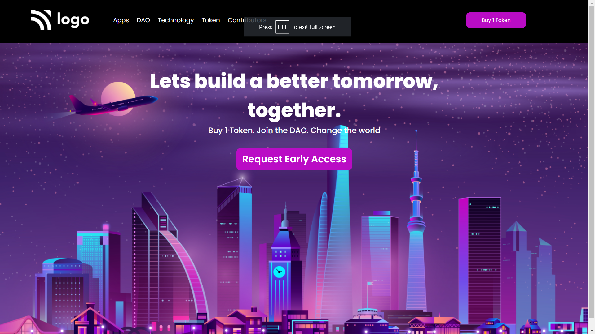

# Crypto based startup

My name is Shivam Sharma, and this is the fifth project and it is landing page of crypto startup.

 Time taken to complete this project is around **2 hrs**

**Key learning :** 

- Manipulating background image as per need
- Different types on units of height and width
- Pseudo selectors like: nth-child()
- How to structure elements on web page

**Technology Used :**

**Deployed On :** 

## Screenshots

## 🔗 Links

